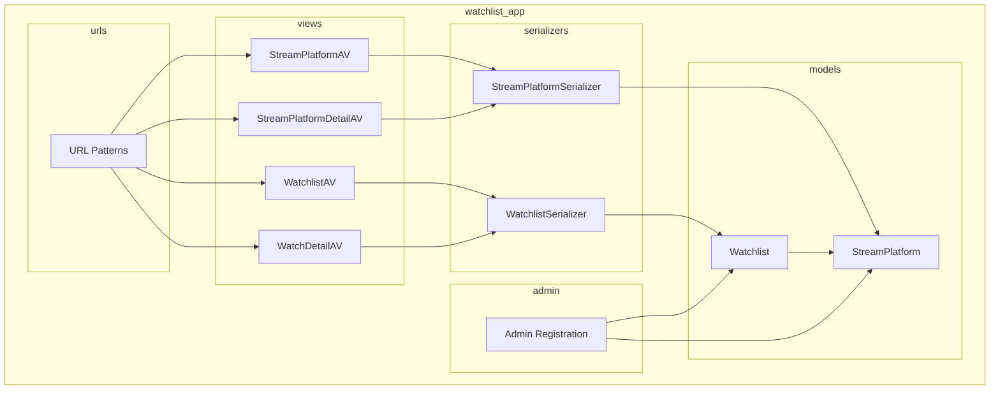

    

    <b>Automatic Architecture Diagrams from Code</b> 
    <a href="https://github.com/swark-io/swark">GitHub</a> • <a href="https://swark.io">Website</a> • <a href="mailto:contact@swark.io">Contact Us</a>

## Usage Instructions

1. **Render the Diagram**: Use the links below to open it in Mermaid Live Editor, or install the [Mermaid Support](https://marketplace.visualstudio.com/items?itemName=bierner.markdown-mermaid) extension.
2. **Recommended Model**: If available for you, use `claude-3.5-sonnet` [language model](vscode://settings/swark.languageModel). It can process more files and generates better diagrams.
3. **Iterate for Best Results**: Language models are non-deterministic. Generate the diagram multiple times and choose the best result.

## Generated Content
**Model**: GPT-4o - [Change Model](vscode://settings/swark.languageModel)  
**Mermaid Live Editor**: [View](https://mermaid.live/view#pako:eNqFkstuwjAQRX_F8hp-IItKgfCKWCDoY5FU1ZQMxJLtRM64qEX8e0NcijGR8Mpn5vreseUj31YF8ojnem-gLtlzkmvWrsZ-usIBaFtK0dAH1LXr3fS_BB6aa_284mxDBkGtJNCuMip-fb8VjAJBggRC3snG2dsl_K6XuF7PSdRFz5iqvaYM5pwEYwQR02v8Q_sGjQApftAEGbMgY_MvDNLm17ReTX-uNeGlFtnLeslWQIRGNw8NoFBC3zqkWXwusjXu22EMkKh0n0-3cduYDYdPbOZg5MO4g7mDxIdZBxMH8w6mDqZ-Z9FB7MPIh7EPf5839Q3SizUfcIVGgSja_37MOZWoMOcRy3mBO7CScn5qRbYugDAR0L6Q4hEZiwMOlqrNt95e2FR2X_JoB7LB0y-kRuwl) | [Edit](https://mermaid.live/edit#pako:eNqFkstuwjAQRX_F8hp-IItKgfCKWCDoY5FU1ZQMxJLtRM64qEX8e0NcijGR8Mpn5vreseUj31YF8ojnem-gLtlzkmvWrsZ-usIBaFtK0dAH1LXr3fS_BB6aa_284mxDBkGtJNCuMip-fb8VjAJBggRC3snG2dsl_K6XuF7PSdRFz5iqvaYM5pwEYwQR02v8Q_sGjQApftAEGbMgY_MvDNLm17ReTX-uNeGlFtnLeslWQIRGNw8NoFBC3zqkWXwusjXu22EMkKh0n0-3cduYDYdPbOZg5MO4g7mDxIdZBxMH8w6mDqZ-Z9FB7MPIh7EPf5839Q3SizUfcIVGgSja_37MOZWoMOcRy3mBO7CScn5qRbYugDAR0L6Q4hEZiwMOlqrNt95e2FR2X_JoB7LB0y-kRuwl)

